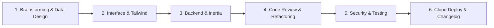

# Laravel & React Agent Skills ⚡

Colección definitiva de **19 Agent Skills** especializadas para potenciar asistentes de Inteligencia Artificial (Claude Code, Cursor, Windsurf, Gemini, Copilot, Amp, Cline, Antigravity) en proyectos basados en **Laravel, Inertia.js, React, Tailwind CSS** y desarrollo web moderno en general.

---

## 🚀 Instalación Rápida: Las 19 Skills en 1 Segundo

Para instalar el kit completo de **19 skills directamente en tu proyecto dentro de `.agents/skills/`** de forma 100% limpia y automática, abre la terminal en la raíz de tu proyecto y ejecuta según tu sistema:

### 🪟 Windows (PowerShell) - Opción directa (1 sola línea):
```powershell
git clone https://github.com/ANONIMUS-B/laravel-agents-skills.git .temp-skills; New-Item -ItemType Directory -Force .agents/skills; Copy-Item -Path ".temp-skills/skills/*" -Destination ".agents/skills" -Recurse -Force; Remove-Item -Recurse -Force .temp-skills
```

### 🪟 Windows (PowerShell) - Vía script remoto:
```powershell
iwr -useb https://raw.githubusercontent.com/ANONIMUS-B/laravel-agents-skills/main/install.ps1 | iex
```

### 🐧 Linux / macOS / Git Bash:
```bash
curl -sSL https://raw.githubusercontent.com/ANONIMUS-B/laravel-agents-skills/main/install.sh | bash
```

---

## 📦 Instalación Individual con Skills CLI

Si prefieres instalar únicamente una skill específica usando la herramienta oficial [skills.sh](https://skills.sh):

```bash
npx skills add https://github.com/ANONIMUS-B/laravel-agents-skills --skill <nombre-de-la-skill>
```

> **Ejemplo:**
> ```bash
> npx skills add https://github.com/ANONIMUS-B/laravel-agents-skills --skill security-audit
> ```

---

## 📚 Catálogo Completo de las 19 Skills

| Skill | Categoría | Descripción | Comando de Instalación Individual |
| :--- | :--- | :--- | :--- |
| **`brainstorming`** | Planificación | Marco estructurado para explorar y diseñar requerimientos antes de escribir código. | `npx skills add https://github.com/ANONIMUS-B/laravel-agents-skills --skill brainstorming` |
| **`database-design`** | Base de Datos | Modelado relacional, estrategias de indexación, claves foráneas y migraciones zero-downtime. | `npx skills add https://github.com/ANONIMUS-B/laravel-agents-skills --skill database-design` |
| **`api-design`** | Arquitectura | Estándares RESTful, respuestas uniformes, códigos de estado HTTP y versionado de APIs. | `npx skills add https://github.com/ANONIMUS-B/laravel-agents-skills --skill api-design` |
| **`interface-design`** | UI / UX | Diseño artesanal de interfaces densas, dashboards y SaaS con estética nivel Stripe/Linear. | `npx skills add https://github.com/ANONIMUS-B/laravel-agents-skills --skill interface-design` |
| **`impeccable`** | Diseño | Auditoría y pulido estético de landing pages, microinteracciones, tipografía y armonía de color. | `npx skills add https://github.com/ANONIMUS-B/laravel-agents-skills --skill impeccable` |
| **`tailwindcss-development`** | Estilos | Maquetación con Tailwind CSS: layouts fluidos, Flexbox/Grid, modo oscuro y diseño responsive. | `npx skills add https://github.com/ANONIMUS-B/laravel-agents-skills --skill tailwindcss-development` |
| **`inertia-react-development`** | Frontend | Desarrollo SPA con Inertia.js v3 y React: formularios `useForm`, instant visits y deferred props. | `npx skills add https://github.com/ANONIMUS-B/laravel-agents-skills --skill inertia-react-development` |
| **`vercel-react-best-practices`** | Rendimiento | Más de 70 directrices de rendimiento de Vercel para eliminar waterfalls y re-renderizados innecesarios. | `npx skills add https://github.com/ANONIMUS-B/laravel-agents-skills --skill vercel-react-best-practices` |
| **`laravel-best-practices`** | Backend | Arquitectura limpia en Laravel: consultas Eloquent optimizadas, FormRequests, Jobs y Policies. | `npx skills add https://github.com/ANONIMUS-B/laravel-agents-skills --skill laravel-best-practices` |
| **`fortify-development`** | Seguridad | Autenticación robusta con Laravel Fortify: 2FA/TOTP con QR, passkeys (WebAuthn) y throttling. | `npx skills add https://github.com/ANONIMUS-B/laravel-agents-skills --skill fortify-development` |
| **`wayfinder-development`** | Integración | Rutas fuertemente tipadas entre endpoints de Laravel y el frontend en TypeScript (`@/actions`, `@/routes`). | `npx skills add https://github.com/ANONIMUS-B/laravel-agents-skills --skill wayfinder-development` |
| **`code-review`** | Calidad | Revisión de código nivel Senior antes de commits o PRs: control de bordes, SOLID y buenas prácticas. | `npx skills add https://github.com/ANONIMUS-B/laravel-agents-skills --skill code-review` |
| **`refactoring-clean-code`** | Clean Code | Refactorización segura de archivos y clases monolíticas aplicando principios SOLID sin alterar el comportamiento. | `npx skills add https://github.com/ANONIMUS-B/laravel-agents-skills --skill refactoring-clean-code` |
| **`security-audit`** | Seguridad | Auditoría preventiva de vulnerabilidades OWASP Top 10, control de acceso roto (IDOR), XSS e inyecciones. | `npx skills add https://github.com/ANONIMUS-B/laravel-agents-skills --skill security-audit` |
| **`systematic-debugging`** | Diagnóstico | Protocolo estricto para depuración: prohíbe parches rápidos y exige encontrar la causa raíz comprobada. | `npx skills add https://github.com/ANONIMUS-B/laravel-agents-skills --skill systematic-debugging` |
| **`testing-best-practices`** | Testing | Diseño de pruebas automatizadas con Pest PHP y PHPUnit: pruebas de características, aislamiento y factories. | `npx skills add https://github.com/ANONIMUS-B/laravel-agents-skills --skill testing-best-practices` |
| **`infer-conventions`** | Convenciones | Escaneo de convenciones y patrones reales del código existente para estandarizar reglas compartidas en `.ai/rules`. | `npx skills add https://github.com/ANONIMUS-B/laravel-agents-skills --skill infer-conventions` |
| **`deploying-to-cloud`** | Despliegue | Configuración, gestión y despliegue continuo en infraestructura Laravel Cloud mediante CLI. | `npx skills add https://github.com/ANONIMUS-B/laravel-agents-skills --skill deploying-to-cloud` |
| **`changelog-generator`** | Release | Generador automático de notas de versión y resúmenes de cambios para usuarios a partir de commits de Git. | `npx skills add https://github.com/ANONIMUS-B/laravel-agents-skills --skill changelog-generator` |

---

## 🔄 Flujo de Trabajo Recomendado



1. **Concepción:** Usa `brainstorming`, `database-design` y `api-design` para planificar.
2. **Diseño:** Usa `interface-design` o `impeccable` con `tailwindcss-development` para el UI.
3. **Desarrollo:** Conecta backend y frontend con `laravel-best-practices`, `inertia-react-development` y `wayfinder-development`.
4. **Optimización & Revisión:** Audita React con `vercel-react-best-practices`, haz `code-review` y limpia deuda con `refactoring-clean-code`.
5. **Seguridad & Pruebas:** Aplica `security-audit`, crea tests con `testing-best-practices` y resuelve fallos con `systematic-debugging`.
6. **Lanzamiento:** Genera notas con `changelog-generator` y despliega con `deploying-to-cloud`.

---

## 🛠️ Estructura del Repositorio

```text
laravel-agents-skills/
├── README.md
├── install.ps1           # Script de instalación para Windows PowerShell
├── install.sh            # Script de instalación para Linux / macOS / Bash
└── skills/
    ├── api-design/
    ├── brainstorming/
    ├── changelog-generator/
    ├── code-review/
    ├── database-design/
    ├── deploying-to-cloud/
    ├── fortify-development/
    ├── impeccable/
    ├── inertia-react-development/
    ├── infer-conventions/
    ├── interface-design/
    ├── laravel-best-practices/
    ├── refactoring-clean-code/
    ├── security-audit/
    ├── systematic-debugging/
    ├── tailwindcss-development/
    ├── testing-best-practices/
    ├── vercel-react-best-practices/
    └── wayfinder-development/
```

---

## 📄 Licencia

Este proyecto está disponible bajo la licencia [MIT](LICENSE). Cada skill mantiene los créditos y licencias de sus respectivos autores originales en la comunidad open source.
